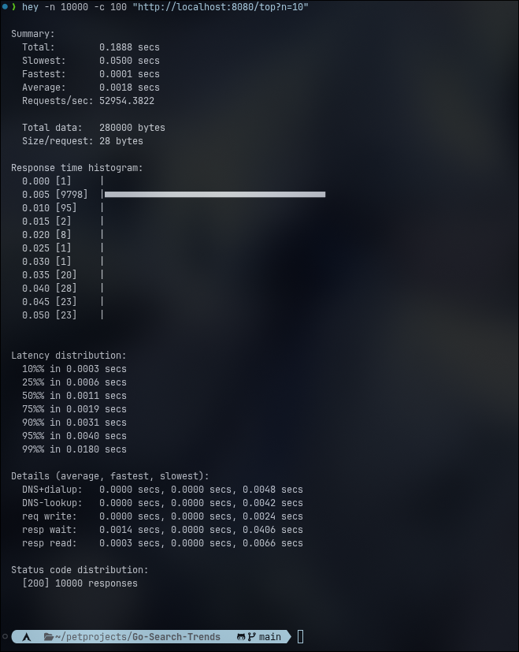

# Go Search Trends

Сервис для отображения актуальных трендов поиска в реальном времени. Читает поток поисковых событий из Kafka и отдаёт топ-N самых популярных запросов за последние 5 минут.

---

## Быстрый запуск

**Требования:** Docker, Docker Compose.

```bash
git clone https://github.com/LeezyWannaFall/Go-Search-Trends.git
cd Go-Search-Trends
docker compose up --build
```

Сервис поднимается на `http://localhost:8080`.

---

## API

### GET /top

Возвращает топ-N самых популярных поисковых запросов за последние 5 минут.

**Параметры:**

| Параметр | Тип | Описание                     | По умолчанию |
|----------|-----|------------------------------|--------------|
| `n`      | int | Количество запросов в ответе | 10           |

**Пример запроса:**

```bash
curl "http://localhost:8080/top?n=5"
```

**Пример ответа:**

```json
[
  {"query": "golang", "count": 42},
  {"query": "kafka", "count": 31},
  {"query": "docker", "count": 17}
]
```

При отсутствии данных за последние 5 минут возвращается `null`.

---

### POST /stoplist/{word}

Добавляет слово в стоп-лист. Запросы с этим словом перестают попадать в топ немедленно, без перезапуска сервиса.

```bash
curl -X POST "http://localhost:8080/stoplist/спам"
```

Ответ: `204 No Content`

---

### DELETE /stoplist/{word}

Удаляет слово из стоп-листа.

```bash
curl -X DELETE "http://localhost:8080/stoplist/спам"
```

Ответ: `204 No Content`

---

### GET /stoplist

Возвращает текущий список заблокированных слов.

```bash
curl "http://localhost:8080/stoplist"
```

**Пример ответа:**

```json
["спам", "реклама"]
```

---

## Тестовая отправка событий

Подключиться к Kafka-продюсеру внутри контейнера:

```bash
docker compose exec kafka \
  kafka-console-producer --bootstrap-server localhost:9092 --topic search-events
```

Ввести событие в формате JSON и нажать Enter:

```json
{"query":"golang","user_id":"u1","timestamp":"2026-05-25T12:00:00Z"}
```

> ⚠️ Поле `timestamp` должно содержать **текущее время** — сервис хранит только данные за последние 5 минут. События с устаревшим временем будут получены, но не попадут в топ.

---

## Контракт данных

### Формат сообщения в Kafka (topic: `search-events`)

```json
{
  "query":     "golang",
  "user_id":   "user-42",
  "timestamp": "2026-05-25T12:00:00Z"
}
```

| Поле        | Тип              | Обязательное | Описание                            |
|-------------|------------------|:------------:|-------------------------------------|
| `query`     | string           | ✅            | Текст поискового запроса            |
| `user_id`   | string           | ✅            | Идентификатор пользователя          |
| `timestamp` | string, RFC 3339 | ✅            | Время совершения поискового запроса |

### Обоснование полей

**`query`** — основная единица данных. Именно по нему считается частота и строится топ.

**`user_id`** — ключевое поле для защиты от накрутки. Внутри каждого минутного бакета запросы от одного пользователя хранятся как множество (`map[string]struct{}`), поэтому вес запроса в топе — это количество **уникальных пользователей**, а не суммарное число обращений. Один бот с фиксированным `user_id` может слать тысячи одинаковых запросов в минуту, но в топе он будет засчитан как `1`.

**`timestamp`** — время совершения поиска **на стороне продуцирующего сервиса**, не время получения события. Это принципиально: сервис строит скользящее окно по реальному времени поиска. Если использовать время получения (server-side), задержки в Kafka или сетевые лаги исказят окно. RFC 3339 выбран как стандарт с поддержкой таймзон — это позволяет корректно принимать события из разных регионов.

---

## Архитектура и выбор структур данных

### Основное хранилище: минутные бакеты

Тип: `map[int64]map[string]map[string]struct{}`

```
buckets = {
  29659854: {                            // минута N-2
    "golang": {"u1":{}, "u2":{}, "u3":{}},
    "kafka":  {"u1":{}, "u5":{}},
  },
  29659855: {                            // минута N-1
    "golang": {"u2":{}, "u4":{}},
    "redis":  {"u3":{}},
  },
  29659856: {                            // минута N (текущая)
    "golang": {"u1":{}},
    "docker": {"u2":{}, "u6":{}, "u7":{}},
  },
}
```

Ключ внешней map — `unix_timestamp / 60`, то есть номер минуты с начала эпохи. Для каждого запроса внутри бакета хранится **множество уникальных `user_id`**. Вес запроса в топе — `len()` этого множества.

**Почему не `map[string]int` (простой счётчик)?** Простой счётчик суммирует все обращения, включая повторные от одного пользователя или бота. Множество `user_id` даёт защиту от накрутки без дополнительного слоя логики.

**Почему не `[]bucket` (слайс)?** Слайс требует знать индекс нужной минуты или линейного поиска. Map даёт O(1) доступ к бакету нужной минуты.

**Почему не heap/priority queue?** Heap ускоряет `GetTop`, но усложняет `Add` — каждая запись требует пересчёта позиции. При соотношении записей и чтений 1:10–50 это не оправдано: проще пересортировать при чтении, чем поддерживать порядок при каждой записи.

**Почему не Redis Sorted Set?** Задача не требует персистентности — данные актуальны только 5 минут. Добавление Redis создаёт сетевую задержку на каждое чтение, что противоречит требованию "максимально быстро". In-memory решение даёт задержку в наносекундах.

### Конкурентный доступ: `sync.RWMutex`

По требованиям ТЗ чтений в 10–50 раз больше, чем записей. `RWMutex` позволяет любому количеству горутин читать одновременно — `GetTop` не блокирует другие `GetTop`. Только `Add` (запись) захватывает эксклюзивную блокировку.

### Стоп-лист: `map[string]struct{}`

`struct{}` не занимает памяти — это идиоматичный Go-способ реализовать множество. Проверка принадлежности — O(1). Управление стоп-листом реализовано через API (`POST /stoplist/{word}`, `DELETE /stoplist/{word}`) и применяется мгновенно без перезапуска сервиса.

---

## Нагрузочное тестирование

Инструмент: [hey](https://github.com/rakyll/hey)

```bash
hey -n 10000 -c 100 "http://localhost:8080/top?n=10"
```



| Метрика | Значение |
|---|---|
| Requests/sec | 52 954 |
| Среднее время ответа | 1.8ms |
| p50 | 1.1ms |
| p99 | 18ms |
| Успешных ответов | 10 000 / 10 000 (200 OK) |

Сервис обрабатывает ~53 000 запросов в секунду на локальной машине,
что соответствует требованию highload с перекосом чтений 10-50x.

---

## Trade-offs и решения по бизнес-логике

### Проблемы, выявленные в постановке

**1. «Последние 5 минут» — неточное определение**

Неясно: это ровно 300 секунд или 5 полных минутных окон? Решение: скользящее окно с минутной гранулярностью. Каждая минута — отдельный бакет. В топ включаются все бакеты с номером минуты `>= (текущая_минута - 5)`. Это чуть менее точно (эффективное окно — от ~4 до ~5 минут в зависимости от момента запроса), но значительно проще в реализации и не требует хранения событий с точностью до секунды. Для виджета "Сейчас ищут" такая погрешность незаметна пользователю.

**2. Аномальные всплески — нет количественного определения**

ТЗ упоминает "конкурентов и парсеров", но не определяет порог отсечения. Реализованное решение: вес запроса в топе — количество **уникальных пользователей** (`user_id`), а не суммарный счётчик. Это нейтрализует накрутку с одного аккаунта. Компромисс: распределённые боты с разными `user_id` по-прежнему могут влиять на топ. Для более глубокой защиты потребовался бы анализ поведенческих паттернов (velocity check, IP rate limiting), что выходит за рамки данного сервиса.

**3. Время события vs. время получения**

Выбрано время события (`event.Timestamp`). Компромисс: если продуцирующий сервис отправляет события с задержкой или неправильными часами, они попадут в некорректный бакет. Альтернатива — использовать `time.Now()` на стороне консьюмера, но тогда теряется смысл поля `timestamp` и окно перестаёт отражать реальную картину поисков. При нормальной работе инфраструктуры задержки в Kafka измеряются миллисекундами и не влияют на попадание в минутный бакет.
